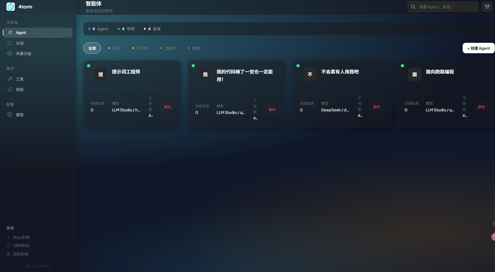
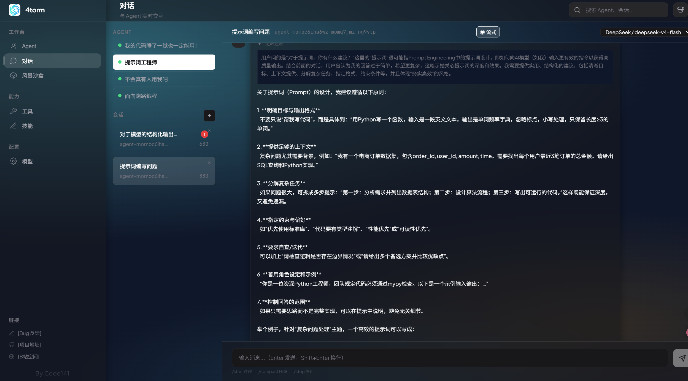
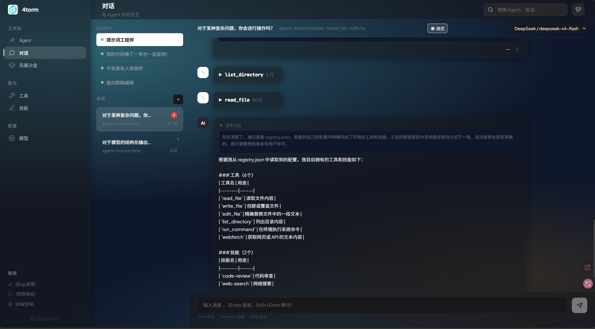
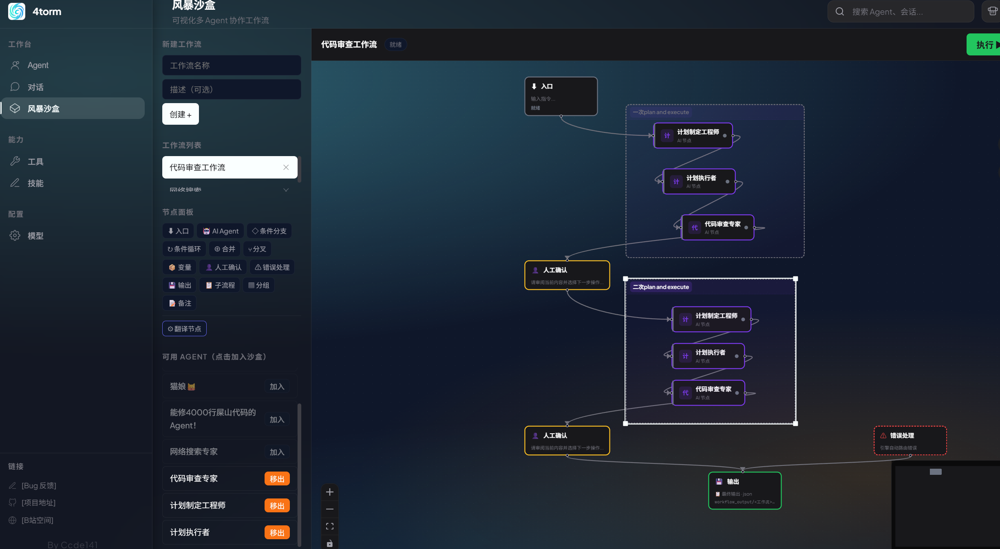
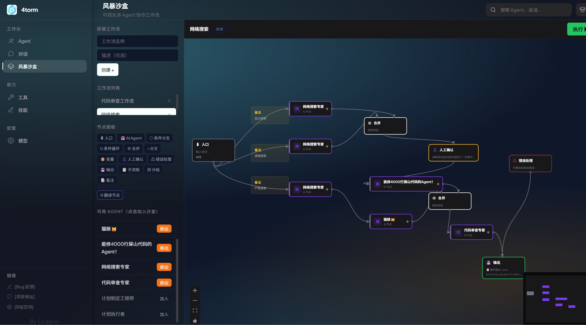
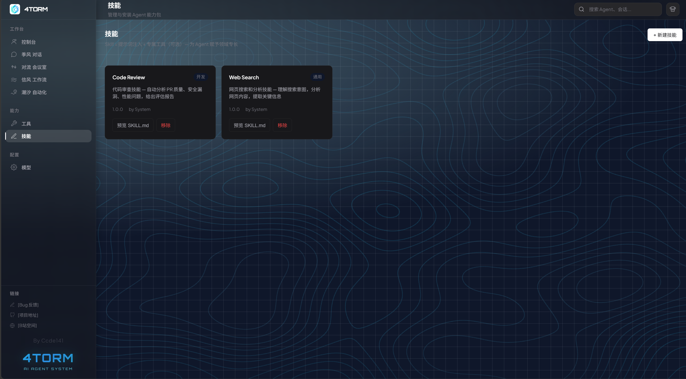
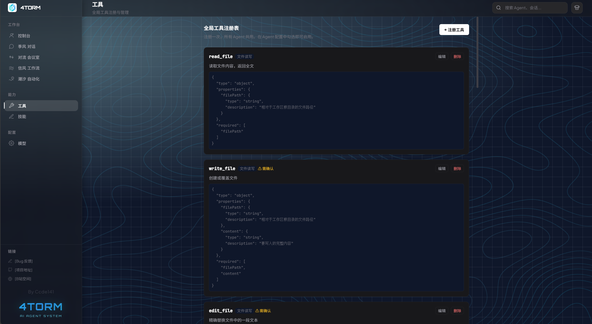
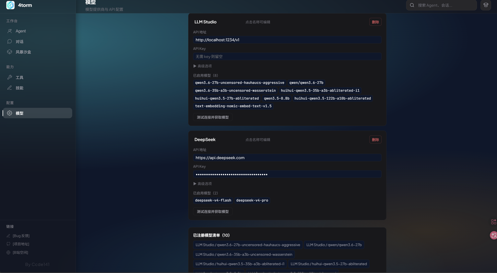

# 4torm

> 4torm —— AI Agent 对话与可视化工作流编排，如风暴般重塑开发方式 [Vibe Coding]

<p align="center">
  
</p>

<p align="center">
  
  
  
  
  
</p>

<p align="center">
  AI Agent 对话 · 图形化工作流编排 · Tool/Skill 体系 · 纯前端运行
</p>

<p align="center">
  <a href="https://github.com/ccde141/4torm/issues">报告 Bug</a>
  ·
  <a href="https://github.com/ccde141/4torm">项目仓库</a>
  ·
  <a href="https://space.bilibili.com/406091025">B站空间</a>
  ·
  <a href="./README_EN.md">English</a>
</p>

---

## 功能特性

### 🤖 AI Agent 对话
多模型兼容（OpenAI / Anthropic / Ollama），流式输出，Think 推理过程实时可见。支持**单 Agent 多会话**架构，每个会话独立维护上下文，Agent 实体与对话历史完全解耦，同一 Agent 可在多个会话中并行运行。

### ⚙️ 提示词驱动的沙箱工作流
拖拽式节点编排引擎。每一条连线（Arrow）不是简单的数据流，而是一套精密的 Prompt 管道系统——`extractField` 按需提取字段、`contextMode` 智能生成上游摘要、`injectRole` 独立实现动态角色链。你不是用代码写逻辑，而是**用提示词定义数据在节点间的语义转换**。

Agent 节点天然具备**工作流感知能力**：引擎在执行时动态注入 `WorkflowContext`，Agent 知道自己处于流水线第几个环节、上下游有哪些、已完成多少内容。

### ⚠️ 沙箱工作流（测试阶段）
沙箱工作流当前处于**测试阶段**，部分功能可能存在不稳定或未完善之处，欢迎提交 Issue 反馈。

### 🧩 Agent 节点：双层解耦设计
- **外层 — Agent 实体引用**（`agentId`）：关联 Agent 的模型配置、工具集、技能列表，Agent 在 Dashboard 中独立管理，与工作流解耦
- **内层 — 运行时角色覆盖**（`agentRole`）：可独立编辑角色提示词，支持 `{{goal}}`、`{{input}}`、`{{context}}`、`{{variables.xxx}}` 等模板变量，同一 Agent 在不同节点中展现不同行为

画布上优先显示节点自身名称（`label`），副标题行以 `↳ Agent原始名` 区分节点标识和 Agent 来源。

### 🧠 长期记忆系统
基于 `MEMORY.md` 的记忆机制，Agent 能感知跨会话的上下文信息，实现持久化记忆。支持 `/compact` 命令压缩对话历史。

### 🔧 Tool / Skill 体系
Agent 可自主读取文档、按需创建工具与技能。内置文件读写、Web 搜索、代码执行等执行器，框架具备运行时自扩展能力。

Skill 的提示词指令通过内置 `use_skill` 工具**按需加载**——Agent 自主判断何时需要专业指导并主动调用，Skill 指令以 `<result>` 形式用完即过，不永久占用上下文。Chat 与 Sandbox 共用同一套机制，Agent 配置中的技能列表同步生效。

### 🎨 个性化皮肤
主色 + 氛围光自由定制，一键切换视觉风格。

### 📦 纯前端运行
无需后端服务。所有数据以 JSON 文件本地存储，配置 API Key 即可在浏览器中完整使用。

## 快速开始

### 环境要求

- Node.js 18+
- npm 9+

### 安装与运行

```bash
git clone https://github.com/ccde141/4torm.git
cd 4torm
npm install
npm run dev
```

浏览器打开 `http://localhost:5173`，在侧边栏 → 设定中添加 AI 服务商 API Key 即可开始使用。

## 截图

### 仪表盘主页 — Dashboard

集中展示所有已注册 Agent 的运行状态。左侧边栏列出 Agent 列表，主区域以卡片呈现会话概览。

<p align="center">
  
  <em>Dashboard — Agent 管理首页</em>
</p>

---

### 多会话聊天 — Session

实时对话界面，支持多会话管理。展示 Think 推理过程与工具调用细节，左侧会话列表支持历史管理。

<p align="center">
  
  <em>Session — 会话聊天界面，展示 Think 思考过程与工具调用</em>
</p>

<p align="center">
  
  <em>Session — 会话聊天界面（二）</em>
</p>

---

### 沙箱工作流 — Sandbox

拖拽节点与连线构建自动化流程。支持入口、Agent、条件分支、并行分叉、合并、人工审批、变量读写、错误处理、输出等节点类型。节点运行时有**实时视觉反馈**（蓝色脉冲 = 执行中、红色边框 = 出错）。工作流完成后可在日志面板点击「📄 查看输出」或双击输出节点，从右侧面板查看完整报告。人工确认同样以右侧面板滑入，不遮挡画布。

<p align="center">
  
  <em>Sandbox — 工作流画布与节点编排</em>
</p>

<p align="center">
  
  <em>Sandbox — 节点参数配置</em>
</p>

---

### 技能管理 — Skills

技能列表页展示所有已注册技能。技能可携带专属工具（tools.json）。Agent 通过内置 `use_skill` 工具按需加载 SKILL.md 提示词，获取专业领域指导。

<p align="center">
  
  <em>Skills — 技能列表页</em>
</p>

---

### 工具管理 — Tools

展示系统内置工具及其参数定义。每个工具含 JSON Schema 参数约束，支持 builtin / template 多种执行类型。

<p align="center">
  
  <em>Tools — 系统内置工具列表</em>
</p>

---

### 模型提供商配置 — LLM Provider

统一管理多模型提供商，内置 OpenAI、Anthropic、Ollama 等预设模板，支持自定义 API 连接。

> 预设均为 OpenAI 兼容服务。使用 Anthropic 等非 OpenAI API，可部署 [one-api](https://github.com/songquanpeng/one-api) 或 [LiteLLM](https://github.com/BerriAI/litellm) 作为翻译层。

<p align="center">
  
  <em>LLM Provider — 多模型提供商配置</em>
</p>

## 使用指南

1. **配置 API Key** — 启动后在侧边栏 → 设定中添加 API Key（支持 OpenAI / Anthropic / Ollama 等）
2. **创建 Agent** — 定义 Agent 的名称、角色描述、模型参数，关联 Tool / Skill
3. **开始对话** — 选择一个 Agent 发起会话，开始 AI Agent 对话
4. **编排工作流** — 切换至沙箱模式，拖拽节点搭建自动化工作流，支持条件分支、并行审查、人工审批等
5. **长期记忆** — 在 Agent 工作区创建 `MEMORY.md`，Agent 自动读取并遵循
6. **命令系统** — 支持 `/compact`（压缩对话历史）、`/start`（重新引导 Agent）

## 技术栈

| 类别 | 技术 |
|------|------|
| 前端框架 | React 19 + TypeScript |
| 构建工具 | Vite |
| LLM 集成 | Anthropic Claude API / OpenAI API 兼容 |
| 状态管理 | Zustand |
| 流程编排 | @xyflow/react v12 |
| 样式系统 | 原生 CSS + CSS 自定义属性 |

## 项目结构

```
4torm/
├── src/
│   ├── components/           # UI 组件
│   │   ├── chat/             # 会话系统（消息流、Think 展示、会话列表）
│   │   ├── sandbox/          # 沙箱工作流（节点拖拽、画布、配置面板）
│   │   ├── layout/           # 布局框架（侧边栏、顶部栏、皮肤面板）
│   │   └── agents/           # Agent 管理（配置、仪表盘）
│   ├── engine/               # 核心引擎（提示词组装、沙箱执行器、ReAct 解析）
│   ├── store/                # 状态管理与数据持久化
│   ├── styles/               # CSS 样式与主题变量
│   └── App.tsx               # 应用根组件
├── docs/                     # 详细文档
│   ├── sandbox-nodes-reference.md
│   ├── tools-reference.md
│   └── skills-reference.md
├── data/                     # 运行时数据（会话、Agent 配置、模型提供商配置）
└── public/                   # 静态资源
```

## 文档

- [沙箱节点参考](./docs/sandbox-nodes-reference.md) — 10 种可用节点的完整配置与行为说明
- [Tool 注册指南](./docs/tools-reference.md) — 如何注册和使用自定义工具（含 `use_skill` 执行器说明）
- [Skill 开发指南](./docs/skills-reference.md) — 如何创建和安装 Agent 技能

## 架构亮点

### 提示词驱动的节点编排

沙箱中每条连线携带 `ArrowConfig`，通过三个语义维度控制节点间数据传递：

| 配置 | 作用 |
|------|------|
| `extractField` | 从上游信封中提取指定字段（`input` / `context` / `role` / `variables.key`）传入下游 |
| `contextMode` | 自动生成上游工作摘要——含上游角色前缀、智能截断于完整段落边界、短内容完整保留 |
| `injectRole` | 用上游输出直接覆盖下游 Agent 角色。**不依赖 `extractField`，独立生效**。覆盖后值被 `resolveTemplate` 解析用于 System Prompt |

每一条边都是一个 Prompt 管道。你定义的是语义转换规则，不是数据格式。

### 工作流感知（WorkflowContext）

引擎在 `executeNode` 中为每个 Agent 节点**动态计算**工作流全貌：

- 从 `workflow.nodes` 提取 Agent 节点生成静态 `nodeManifest`
- 检查 `ctx.envelopes` 中已完成节点，生成上下游视图（✓ 已完成 / ← 你 / 下游）
- 同时注入 ReAct 路径（`runReActLoop`）和无工具路径（`buildAgentSystemPrompt`）

Agent 从「收到一串文字」变成「拿到一张地图」。数据全部来自运行时已有的 `ctx.envelopes`，无额外 I/O 开销。

### Agent 节点：双层解耦

- **外层 — Agent 实体引用**（`agentId`）：通过只读引用关联 Agent 的模型、工具、技能，Agent 在 Dashboard 中独立管理
- **内层 — 运行时角色覆盖**（`agentRole` / `label`）：工作流节点可独立命名并覆盖角色提示词，同一 Agent 在不同节点展现不同行为。`label` 优先级高于 Agent 原始名

### 三层架构

```
Dashboard (Agent 管理)          Sandbox (工作流)             Chat (会话)
     │                              │                          │
     │  Agent 实体                    │   Envelope              │  消息列表
     │  (模型/工具/技能)              │   (纯数据结构)           │   (对话历史)
     │  只读引用 ◄──────              │                          │
     │                              │  零 chat 依赖             │
     │                              │  独立文件存储             │
     │                              │  独立状态管理             │
```

- **沙箱与会话完全解耦** — 沙箱使用独立 `Envelope` 数据结构，所有 LLM 调用为 stateless 请求
- **沙箱与 Agent 松耦合** — 工作流节点仅通过 `agentId` 只读引用 Agent 配置
- **文件即数据库** — 所有数据以 JSON 文件存储
- **自扩展 Agent** — Agent 可读取文档自主创建 Tool/Skill

### 按需加载的 Skill 体系

Skill 提示词不自动注入 System Prompt。Agent 通过内置 `use_skill` 工具自主决定何时加载——Skill 指令以 `<result>` 形式出现在对话中，`/compact` 后可被压缩。Chat 与 Sandbox 共用同一执行器（`data/tools/executors/use_skill.js`），Agent 配置中的技能列表同步生效。

## 如何贡献

欢迎提交 Issue 和 Pull Request！

- 提 Issue 前请先搜索是否已有相同问题
- 本地开发：`npm install` → `npm run dev`
- 代码风格：TypeScript 严格模式

## 许可证

[MIT](./LICENSE) © Ccde141

## 联系方式

- Bilibili: [space.bilibili.com/406091025](https://space.bilibili.com/406091025)
- GitHub Issues: [github.com/ccde141/4torm/issues](https://github.com/ccde141/4torm/issues)
- 项目地址: [github.com/ccde141/4torm](https://github.com/ccde141/4torm)
