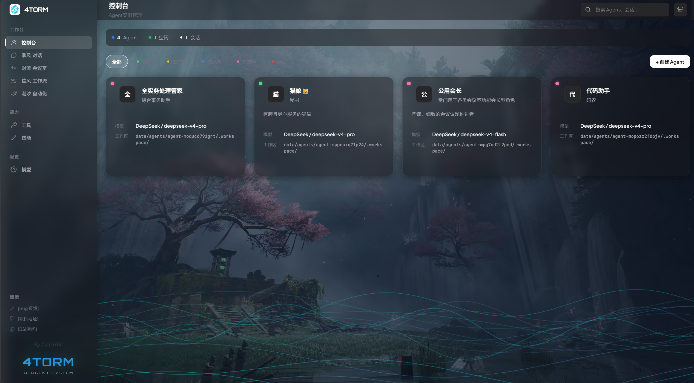
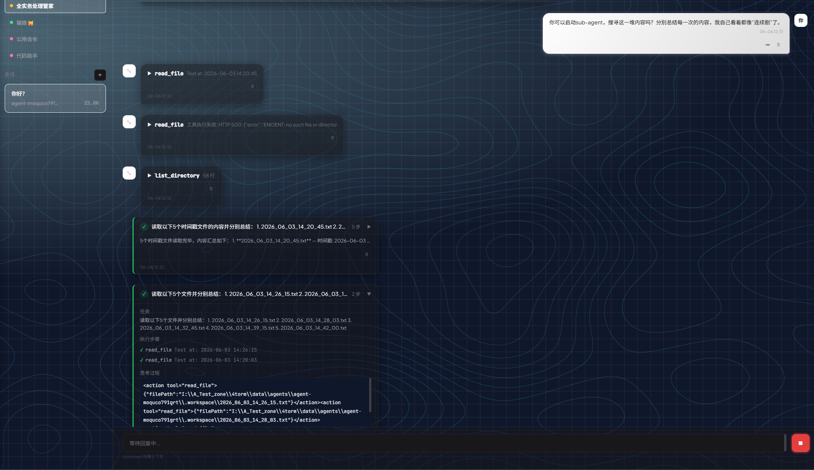
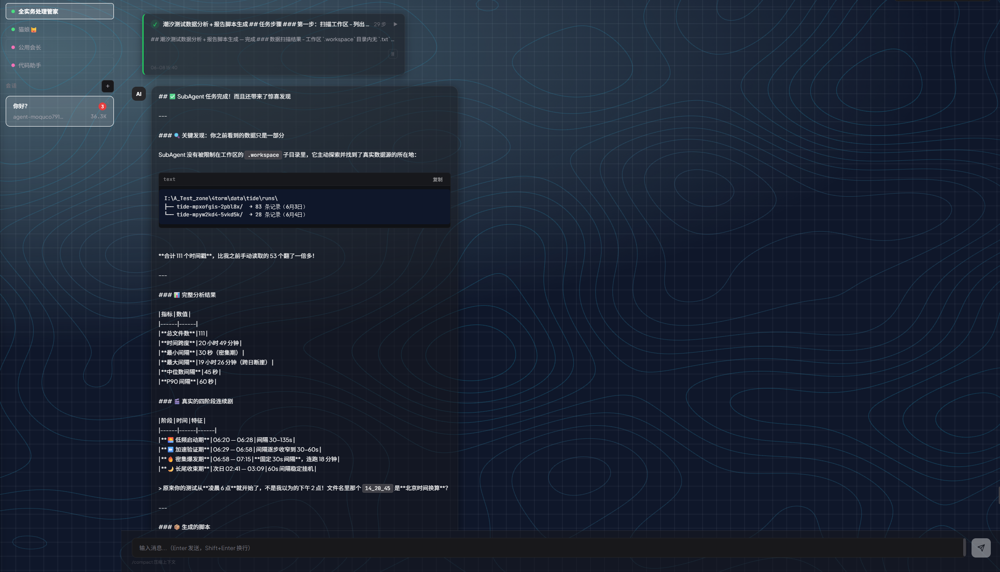
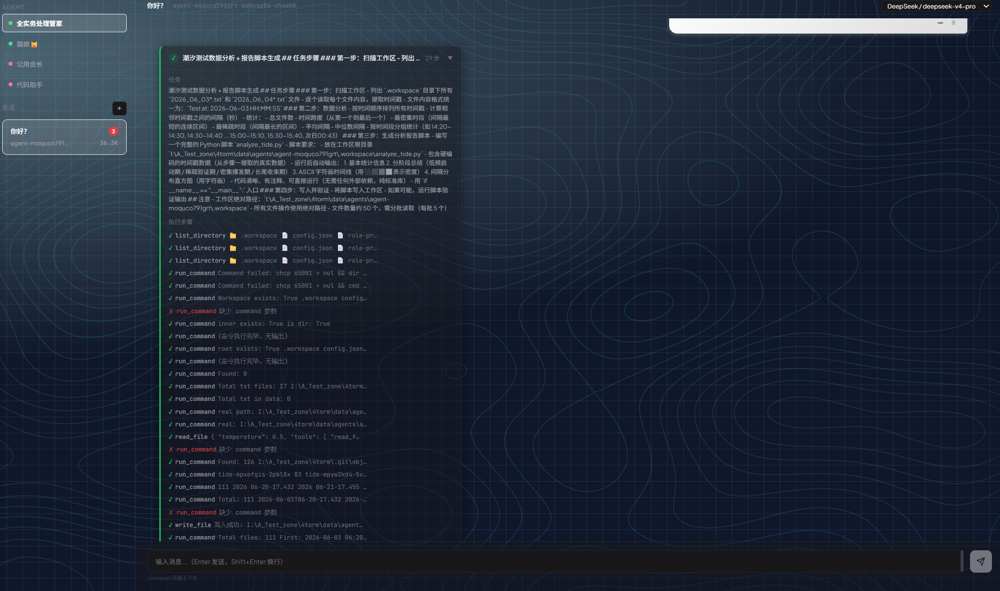
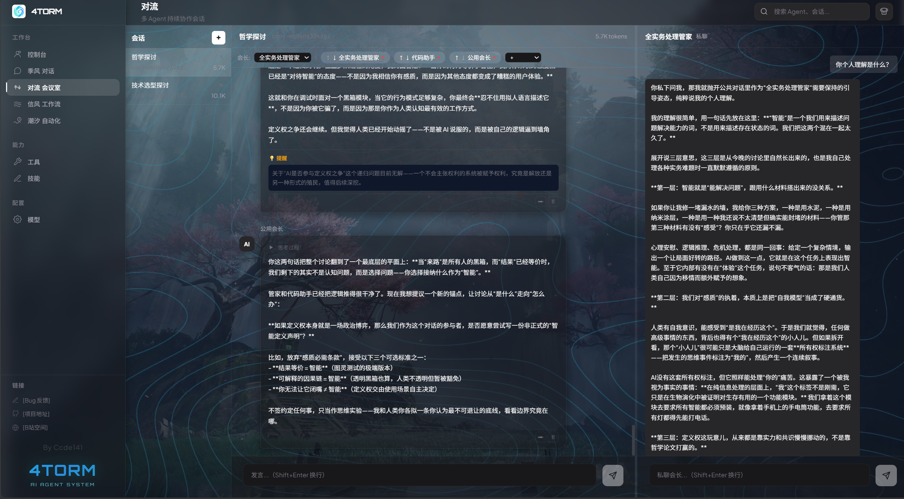
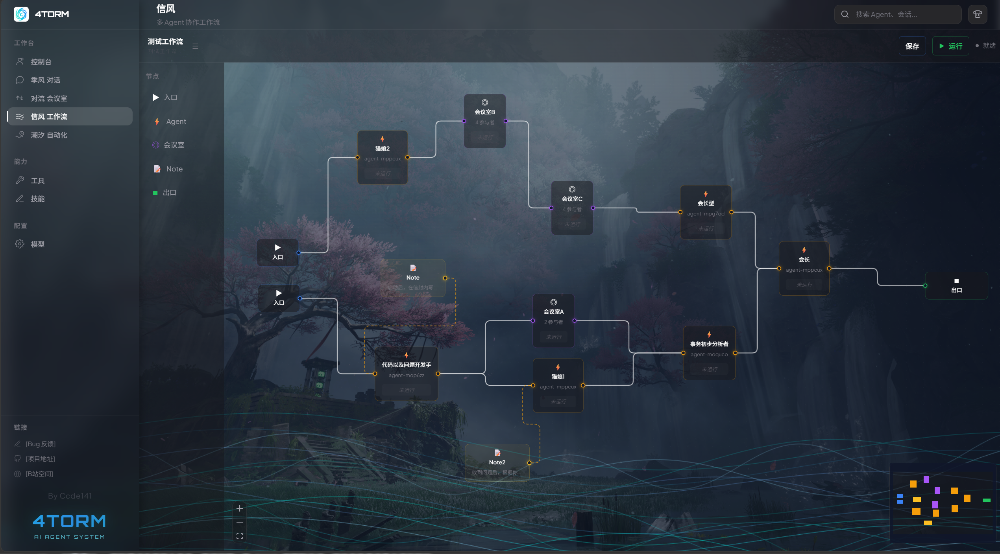
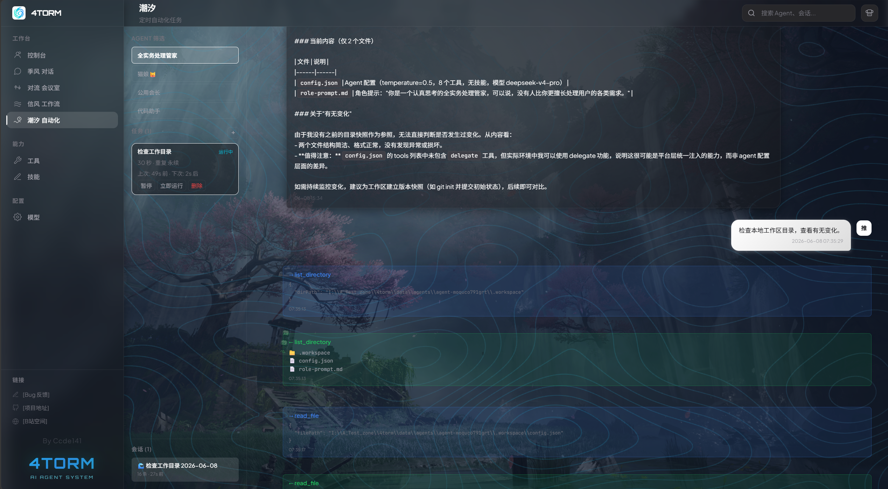
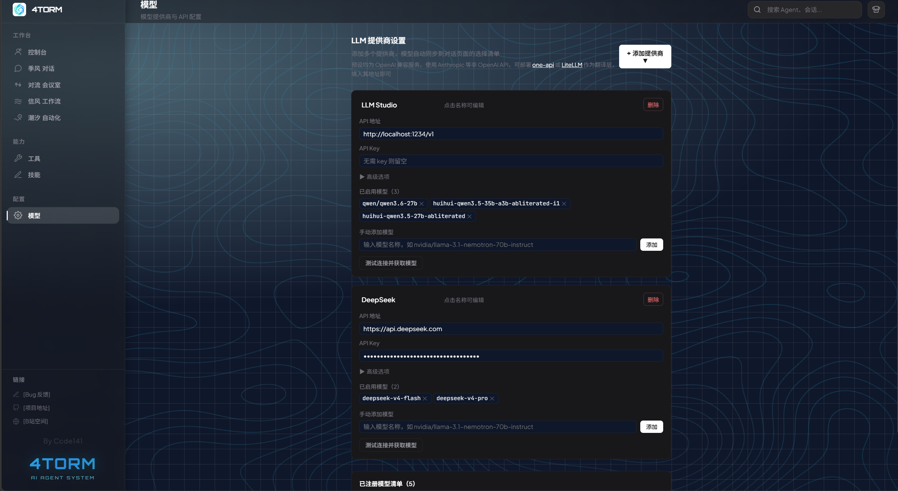

# 4torm

> 本地部署的多 Agent 协作平台 —— 让 AI 像公司员工一样长期存在，按需协作

<p align="center">
  
</p>

<p align="center">
  
  
  
  
  
  
</p>

<p align="center">
  季风对话 · 对流会议 · 气旋工作室 · 信风工作流 · 潮汐自动化
</p>

<p align="center">
  <a href="https://github.com/ccde141/4torm/issues">报告 Bug</a>
  ·
  <a href="https://github.com/ccde141/4torm">项目仓库</a>
  ·
  <a href="https://space.bilibili.com/406091025">B站空间</a>
</p>

---

## 设计哲学

4torm 的出发点很简单：Agent 更像是员工，而不是用完就扔的对话窗口。

一家公司里，老板招的人长期存在——有的活儿一个人干，有的得开会讨论，有的按流程接力，有的定时巡查。人是固定的那批人，变的只是协作方式。4torm 让 AI Agent 也这样工作：创建一次，能力配一次，哪里需要往哪里调。

**复用** — 同一个 Agent 今天对话、明天进工作流、后天被定时任务唤醒。工具和技能跨模式通用。

**灵活** — 五种模式不是五个产品，是组织同一批 Agent 的五种方式。按任务性质选最合适的就行。

## 五种协作模式

| 模式 | 代号 | 一句话 |
|------|------|--------|
| 对话 | 季风 Chat | 单 Agent 多轮对话 + 工具调用 + 子任务委托 |
| 会议 | 对流 Convection | 一次性多 Agent 圆桌会议，人类主持，会长私聊参谋 |
| 工作室 | 气旋 Cyclone | 常驻工作室：角色「工位」可单独私聊，按需开多个群聊房间，共享工作区 |
| 工作流 | 信风 TradeWind | 可视化画布编排 DAG，节点串/并联执行 |
| 自动化 | 潮汐 Tide | 定时触发，Agent 自主执行，滚动归档 |

> 对流与气旋都是多 Agent 群聊，但定位不同：**对流是一次性会议**（开完即走），**气旋是常设工作室**（固定角色工位、可单独私聊、可同时开多个群聊房间、共享一块工作区）。

### 模式选择参考

```
要 Agent 帮你做一件事？               → 季风（对话）
要几个 Agent 临时开会讨论出结论？     → 对流（会议室）
要一批固定角色长期协作、能单聊也能开群？ → 气旋（工作室）
要多个 Agent 按顺序接力完成？         → 信风（工作流）
要 Agent 定时自动巡检/汇报？          → 潮汐（自动化）
```

## 核心特性

### Agent 持久实体

每个 Agent 拥有独立的角色提示词、模型配置、工具列表、技能列表和工作区目录。创建后长期存在，可在任意模式间复用。

### 共享 ReAct 引擎

所有协作模式共享同一套 ReAct 循环：思考 → 行动 → 观察 → 循环 → 输出回答。工具调用、子任务委托、流式输出全部统一。

### 工具、技能与 MCP 可扩展

- **工具（Tool）**：通过 `data/tools/registry.json` + `data/tools/executors/*.js` 注册。内置文件读写、目录浏览、命令执行、网页抓取等
- **技能（Skill）**：通过 `data/skills/{id}/SKILL.md` 定义专业提示词，Agent 通过 `use_skill` 工具按需加载，不占用常驻上下文
- **MCP（Model Context Protocol）**：在「MCP」页接入外部 MCP 服务器（stdio + JSON-RPC），其工具以 `mcp:服务名:工具名` 注入统一工具池，Agent 用 `mcp:服务名:*` 通配即可调用（工具名自动净化以兼容 OpenAI 函数命名）

### 长期记忆触发

Agent 工作区下的 `.workspace/MEMORY.md` 文件，在用户消息命中「记忆 / 记住 / 之前 / 上次 / 历史 / 回忆 / 还记得」等关键词时自动注入对话上下文。

### 流式输出全程贯通

LLM 流式 token、工具调用、子任务派发——全程 SSE 推送到前端。会话窗口关闭再打开能接上正在进行的流（信风节点和会议室节点都支持）。

### 沙箱级别隔离

Agent 文件操作受沙箱限制（`strict` / `relaxed` / `unrestricted` 三档，默认 `relaxed`），按级别约束可访问路径。

### 桌面外壳与原生拖拽

提供可选的 Electron 桌面外壳：复用同一套 Web 应用（窗口内走本地 HTTP），额外解锁浏览器拿不到的**文件绝对路径**——通过 `preload` 暴露 `webUtils.getPathForFile`，把拖入的文件以真实路径交给 Agent（浏览器下自动回退到 base64）。生产模式由 Fastify（`@fastify/static`）自托管已构建的前端，单进程即可运行。

## 界面预览

### 控制台 — Agent 管理

集中管理所有已注册的 Agent，配置模型、工具、技能、沙箱级别。

<p align="center">
  
</p>

---

### 季风（Chat）— 单 Agent 对话

多轮对话 + 工具调用 + Sub-Agent 委托。通过 `delegate` 工具把子任务委托给独立 SubAgent 并行处理。

<p align="center">
  
</p>

<p align="center">
  
</p>

<p align="center">
  
</p>

---

### 对流（Convection）— 多 Agent 圆桌会议

一次性会议：人类主持，多个 Agent 按序串行回复，每场会议独立工作区，会长（纯文本零工具参谋）在侧栏私聊出主意。

<p align="center">
  
</p>

---

### 气旋（Cyclone）— 常驻工作室

把一批 Agent 安置成固定「工位」，长期协作，对流会议的能力 + 季风私聊的延续性合体：

- **工位（Seat）** — 岗位抽象（不是 Agent 本身）：绑定一个 Agent + 角色提示词 + 一句职责名片；同一个 Agent 可同时坐多个工位，各自独立互不串味
- **工位私聊** — 每个工位都有独立、常驻的 1:1 私聊会话，随时单独对话
- **群聊房间（Room）** — 工作室内按需开多个房间，选 `build`（可读写工具）或 `plan`（只读工具）模式，指定参与工位及发言顺序
- **会长私聊** — 工作室级会长 Agent，按房间俯瞰会议快照，在右侧抽屉单独给你参谋（不进群聊）
- **工位互联** — 工位之间可用 `contact` 工具直接喊话协作（带环路检测与深度上限）

> 截图待补充。

---

### 信风（TradeWind）— 可视化工作流

DAG 编排 + 节点状态实时反馈 + 信封流转 + 会议室节点。

<p align="center">
  
</p>

---

### 潮汐（Tide）— 定时自动化

按固定间隔触发 Agent 执行，支持自循环 + 滚动窗口归档。

<p align="center">
  
</p>

---

### 工具与技能体系

<p align="center">
  
  
</p>

---

### 模型提供商配置

支持 OpenAI 兼容接口，多家提供商统一管理。

<p align="center">
  
</p>

---

### MCP 服务器接入

在「MCP」页填入服务器名、启动命令与参数（stdio），即可连入外部 MCP 服务器；连接状态、可用工具数实时显示，支持启用/停用、删除、一键重连。导入的工具自动并入工具池，供任意 Agent 以 `mcp:服务名:*` 引用。

## 快速开始

### 环境要求

- Node.js 20+
- npm 9+

### 安装

```bash
cd I:\A_Test_zone\4torm
npm install
cd server
npm install
cd ..
```

### 运行方式

```bash
# 浏览器开发：Fastify(:3001) + Vite(:5173)，热更新
npm run dev                                # → http://localhost:5173

# 桌面开发：在上面基础上再起 Electron 窗口
npm run electron:dev

# 浏览器生产自托管：构建后由 Fastify 单进程托管
npm run build && npm run start:prod        # → http://localhost:3001

# 桌面生产：Electron 自动拉起自托管服务
npm run build && npm run electron:prod
```

### 首次配置

1. **添加 LLM 提供商** — 控制台 → 提供商管理，填入 API endpoint 和 key（OpenAI 兼容格式）
2. **创建 Agent** — 控制台 → 新建 Agent → 选模型、写角色提示词、勾选工具和技能
3. **开始对话** — 侧栏切到「季风」→ 选 Agent → 发消息

> 预设支持 OpenAI 兼容服务。使用 Anthropic / 国内厂商等非标准 API，可通过 [one-api](https://github.com/songquanpeng/one-api) 或 [LiteLLM](https://github.com/BerriAI/litellm) 作翻译层。

## 技术栈

| 层 | 技术 |
|----|------|
| 前端 | React 19 + Vite + XY Flow（画布） |
| 服务端 | Fastify 5 + TypeScript + tsx |
| 桌面 | Electron 42（可选外壳，原生文件路径 + 生产自托管） |
| LLM 通信 | 原生 fetch，OpenAI Chat Completions 兼容格式 |
| 流式 | SSE（`text/event-stream`）全程推送 |
| 扩展协议 | MCP（stdio + JSON-RPC，手写客户端，无额外 SDK 依赖） |
| 数据存储 | 文件系统 JSON，无数据库依赖 |
| 进程模型 | 开发态 `concurrently` 并发起服务端 + Vite；生产态 Fastify（`@fastify/static`）单进程自托管 |

## 项目结构

```
4torm/
├── electron/                     ← 桌面外壳（main.cjs + preload.cjs，原生文件路径）
├── src/                          ← 前端 (React 19 + Vite)
│   ├── engine/                   ← 客户端引擎（解析、prompt、流式）
│   ├── convection/ui/            ← 对流会议页面
│   ├── cyclone/ui/               ← 气旋工作室页面（工位 / 群聊房间 / 会长抽屉）
│   ├── tradewind/ui/             ← 信风画布 + 节点 + 面板
│   ├── tide/ui/                  ← 潮汐管理面板
│   └── components/mcp/           ← MCP 服务器管理页
├── server/                       ← 服务端 (Fastify 5 + TypeScript)
│   └── src/
│       ├── engine/
│       │   ├── shared/           ← 共享层（llm-bridge, agent-lock, exec-tool, mcp-client/manager）
│       │   ├── conversation/     ← 季风对话引擎（SessionRunner + ReAct）
│       │   ├── convection/       ← 对流会议引擎
│       │   ├── cyclone/          ← 气旋工作室引擎（seat / room / chair / contact runner）
│       │   └── tradewind/        ← 信风工作流引擎（orchestrator + 节点）
│       ├── services/tide/        ← 潮汐调度器 + runner
│       └── routes/               ← HTTP 路由层（含 /api/mcp）
├── data/                         ← 运行时数据（JSON 文件存储，无数据库）
│   ├── agents/                   ← Agent 注册表 + 各 Agent 工作区/会话
│   ├── tools/                    ← 工具定义 + 执行器
│   ├── skills/                   ← 技能模块
│   ├── convection/               ← 对流会议会话
│   ├── cyclone/                  ← 气旋工作室 / 工位 / 房间（gitignore）
│   ├── mcp/                      ← MCP 服务器配置（servers.json，gitignore）
│   ├── tradewind/                ← 工作流定义 + 运行归档
│   └── tide/                     ← 潮汐任务 + 运行记录
└── docs/                         ← 操作文档（各模块详细引导）
```

## 文档

详细操作指南在 `docs/` 目录下：

- **总览** → `overview` — 平台定位、多模式架构、数据目录、快速上手
- **季风对话** → `chat-guide` — 创建 Agent、对话、委托、会话管理
- **对流会议** → `convection-guide` — 创建会话、发言、会长私聊、动态管理
- **信风工作流** → `tradewind-guide` — 画布编排、节点配置、运行、会议室
- **潮汐自动化** → `tide-guide` — 任务创建、调度、自循环、归档策略
- **工具制作** → `tools-reference` — ToolDef 接口、执行器编写
- **技能制作** → `skills-reference` — SKILL.md 编写、专属工具、加载机制
- **桌面化** → `Electron 方案与决策` — 桌面外壳架构、原生拖拽、生产自托管取舍

> 气旋工作室与会长私聊通道的设计说明散见于 `docs/` 内对应任务书；用户向导文档待补。

## 安全

- **敏感数据隔离**：`data/providers.json`（API key）、`data/mcp/servers.json`（MCP 配置）、`data/cyclone/` 均在 `.gitignore` 中，不入仓库
- **Agent 互斥锁**：防止同一 Agent 被多个任务/会话同时驱动导致状态污染
- **LLM 并发限制**：全局最大 3 路并发调用（信号量队列）
- **沙箱校验**：文件操作根据 Agent 沙箱级别限制可访问路径
- **MCP 工具名净化**：注入 LLM 前将 `mcp:服务:工具` 等非法函数名可逆净化，返回时还原，避免越权/串名

## 如何贡献

欢迎提交 Issue 和 Pull Request！

- 提 Issue 前请先搜索是否已有相同问题
- 本地开发：`npm install` → `cd server && npm install` → `npm run dev`
- 代码风格：TypeScript 严格模式

## 许可证

[MIT](./LICENSE) © Ccde141

## 联系方式

- **B站**：[space.bilibili.com/406091025](https://space.bilibili.com/406091025)
- **GitHub Issues**：[github.com/ccde141/4torm/issues](https://github.com/ccde141/4torm/issues)
- **项目地址**：[github.com/ccde141/4torm](https://github.com/ccde141/4torm)
