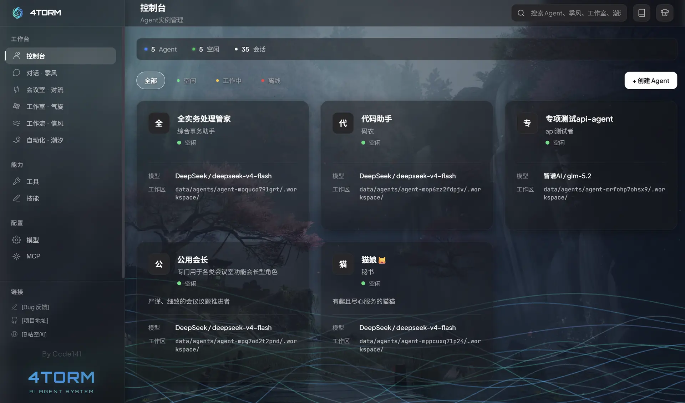
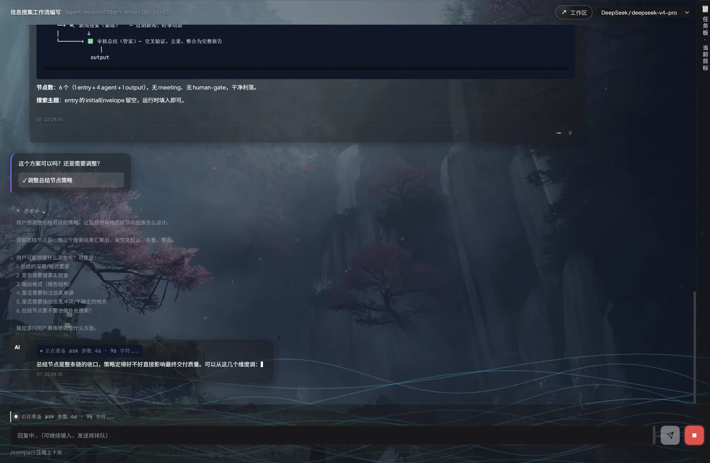
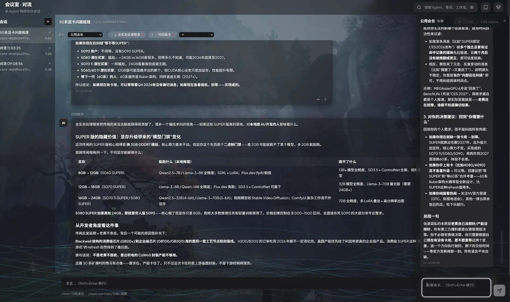
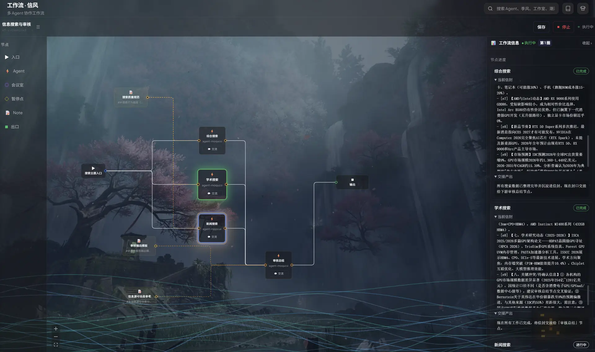

# 4torm

<p align="center">
  
</p>

<p align="center">
  <strong>让 AI 像公司员工一样长期存在，按需协作</strong>
</p>

<p align="center">
  
  
  
  
</p>

4torm 是一个多 Agent 协作框架，可以创建多个长期保留的 Agent，让它们独立对话、组队讨论、按工作流接力，或按照时间表自动执行任务

同一个 Agent 可以在不同功能区中复用。模型、提示词、工具和技能只需配置一次，之后根据任务选择合适的协作方式

<p align="center">
  
</p>

## 五种协作方式

| 模式 | 功能区 | 适合处理 |
|------|--------|----------|
| 对话 | 季风 Chat | 与单个 Agent 持续交流、调用工具或委托 SubAgent |
| 会议 | 对流 Convection | 让多个 Agent 临时讨论，由会长提供单独建议 |
| 工作室 | 气旋 Cyclone | 让固定工位长期协作，支持私聊、群聊、同步联络和异步派发 |
| 工作流 | 信风 TradeWind | 在可视化画布上组织节点，让任务按照连线流转 |
| 自动化 | 潮汐 Tide | 按照设定时间唤醒 Agent，持续执行巡检、整理和汇报 |

```text
让一个 Agent 帮你完成任务               → 季风
让几个 Agent 临时讨论并形成结论         → 对流
让一批固定角色长期协作                  → 气旋
让多个 Agent 按照流程接力               → 信风
让 Agent 按照时间自动运行               → 潮汐
```

五种功能区使用的是同一套 Agent。变化的是协作方式，不是重新创建一批临时角色

## 看得见的执行过程

Agent 运行时，界面会持续显示等待模型、生成内容、准备工具参数和执行工具等状态

思考内容与正式回复分开呈现，工具调用保留参数和结果，文件修改可以直接查看差异。遇到长时间写入或复杂命令时，也能看到 Agent 当前正在处理什么

<p align="center">
  
</p>

## 多 Agent 协作

对流适合临时会议，气旋适合长期协作

气旋工作室由多个固定工位组成，每个工位拥有独立私聊和任务板，同时共享工作室文件。群聊中的 Agent 可以通过 `contact` 向工位同步询问信息，也可以通过 `dispatch` 异步派发需要较长时间完成的任务

<p align="center">
  
</p>

## 可视化工作流

信风使用可视化画布编排任务，支持 Agent、会议室、暂停点与出入口等节点

工作流可以串行或并行流转信封，运行过程中能够查看节点状态、进入 Agent 会话、暂停尚未交付的任务，并在需要时由人类介入

<p align="center">
  
</p>

## 工具、技能与 MCP

4torm 通过三种方式扩展 Agent 能力：

- **工具**：为 Agent 提供文件、命令、网络或其他可执行操作
- **技能**：通过 `SKILL.md` 提供可复用的专业知识与工作方法
- **MCP**：连接 stdio、Streamable HTTP 和兼容 SSE 的外部工具服务

新建 Agent 默认启用框架内置工具和已经安装的技能，自定义工具与 MCP 工具需要明确选择

季风和气旋中的 Agent 还可以根据人类要求创建新的工具或技能，工具注册需要确认，技能目录完成后会自动载入

## 快速开始

### 环境要求

- Node.js 20+
- npm 9+

### 安装依赖

```bash
git clone https://github.com/ccde141/4torm.git
cd 4torm

npm install
npm --prefix server install
```

### 启动

浏览器开发模式：

```bash
npm run dev
```

打开 `http://localhost:5173`

桌面开发模式：

```bash
npm run electron:dev
```

生产构建与运行：

```bash
npm run build
npm run start:prod
```

打开 `http://localhost:3001`

### 首次使用

1. 在提供商管理中添加模型接口
2. 进入控制台创建 Agent
3. 配置模型、角色提示词、工具和技能
4. 从季风开始一段对话，或进入其他功能区组织协作

4torm 使用 OpenAI Chat Completions 兼容格式。其他接口可以通过兼容网关接入

## 文档

应用启动后，可以从顶部的「使用文档」进入完整文档站

| 内容 | 文档 |
|------|------|
| 安装与首次配置 | [快速开始](./docs/guide/getting-started.md) |
| Agent、会话与工作区 | [核心概念](./docs/guide/concepts.md) |
| Agent 创建与配置 | [Agent 管理](./docs/guide/agents.md) |
| 五种功能区 | [季风](./docs/modes/chat.md) · [对流](./docs/modes/convection.md) · [气旋](./docs/modes/cyclone.md) · [信风](./docs/modes/tradewind.md) · [潮汐](./docs/modes/tide.md) |
| 扩展 Agent 能力 | [工具](./docs/extend/tools.md) · [技能](./docs/extend/skills.md) · [MCP](./docs/extend/mcp.md) |
| 开发与维护 | [总体架构](./docs/architecture/overview.md) · [数据目录](./docs/architecture/data-layout.md) · [安全边界](./docs/architecture/security.md) |

单独预览文档站：

```bash
npm run docs:dev
```

打开 `http://localhost:5174`

## 数据与权限

运行数据保存在 `data/` 目录中，Agent、会话、工作室、工作流和自动化任务分别维护自己的数据边界

API Key、MCP 配置以及各功能区的运行数据已经按用途加入 Git 忽略。Git 忽略不等于数据备份，迁移项目前仍应单独备份需要保留的 `data/` 内容

Agent 的内置文件工具提供两档权限：

- **项目级**：访问 4torm 项目和当前功能区工作区
- **无限制**：允许访问项目之外的其他路径

框架状态仍通过专用入口管理，避免 Agent 绕过功能工具直接改写任务、工作流等控制数据

## 技术栈

- React 19、TypeScript、Vite
- Fastify 5
- Electron
- XY Flow
- Server-Sent Events
- Model Context Protocol

## 许可证

[MIT](./LICENSE) © Ccde141

## 链接

- [GitHub Issues](https://github.com/ccde141/4torm/issues)
- [Bilibili](https://space.bilibili.com/406091025)
